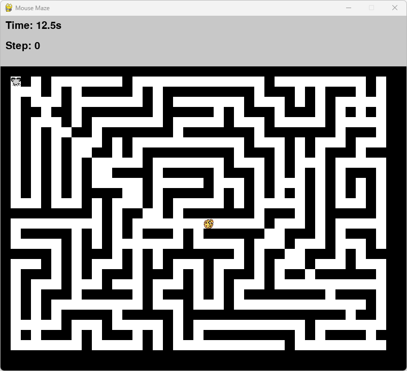

**Introduction for "Mouse Maze" Game**

In the game "Mouse Maze," you will control a mouse to navigate through a maze and reach a pizza located at the center. Your objective is to move the mouse from any corner of the maze to the pizza as quickly as possible. You also have the option to enable AI mode, which allows the mouse to automatically find the shortest path to the pizza.

**Apply 4 algorithms to define the way for the rat to eat pizza**

When AI mode is enabled, the mouse will automatically find its way to the pizza.
Hotkeys:
P Key: Pause/Resume the game.
R Key: Reset the game.
1 Key: Switch to Dijkstra's Algorithm.
2 Key: Switch to Bellman-Ford Algorithm.
3 Key: Switch to BFS Algorithm.
4 Key: Switch to DFS Algorithm.

**Game Features**

Time: Shows the elapsed time since the game started.
Path Length: Displays the number of moves made by the mouse since the game began.

**Victory Effect:**

When the mouse eats the pizza, the game will pause and display a firework effect for 2 seconds to celebrate your success.